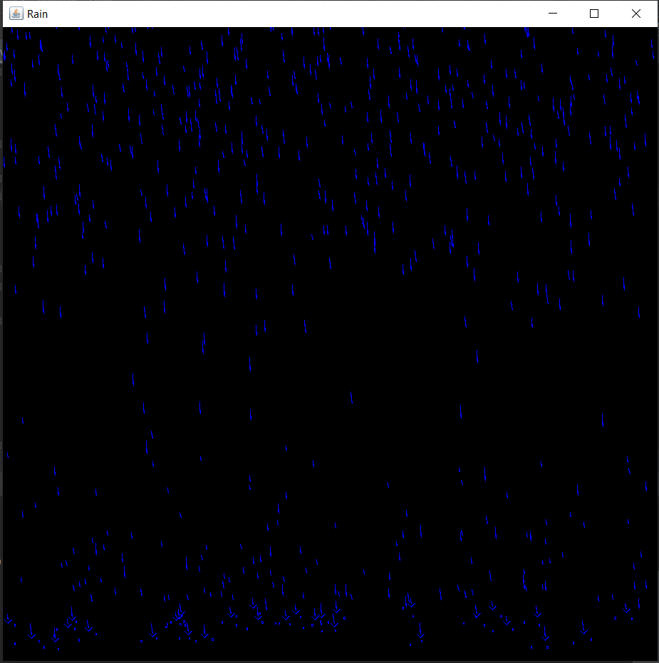
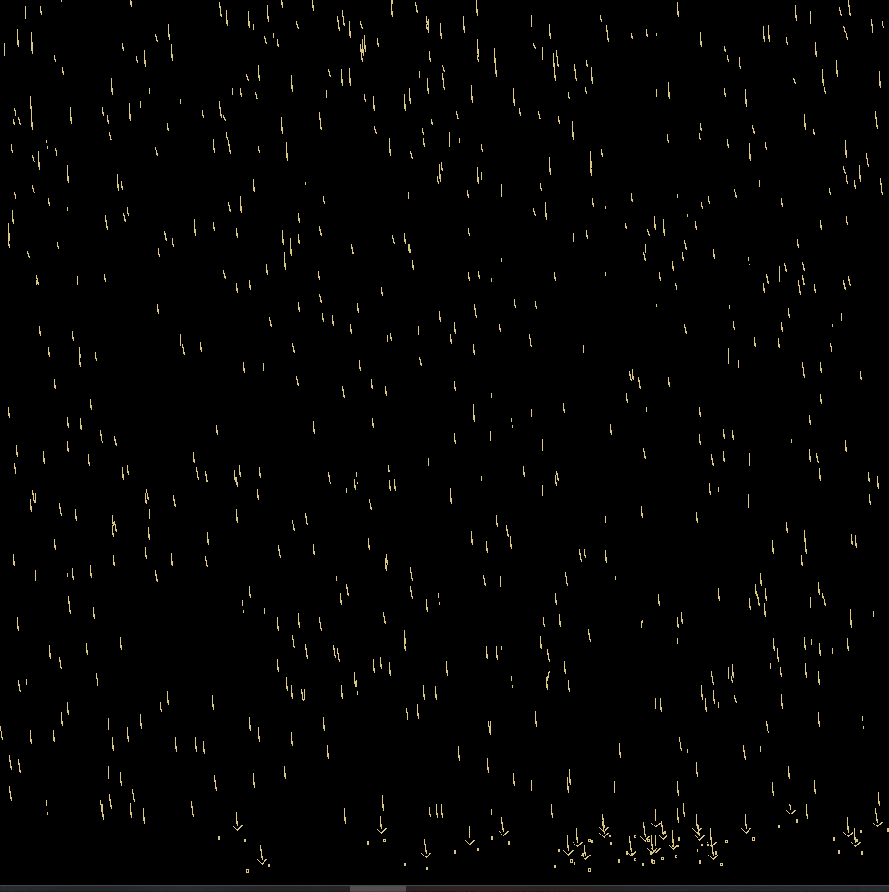
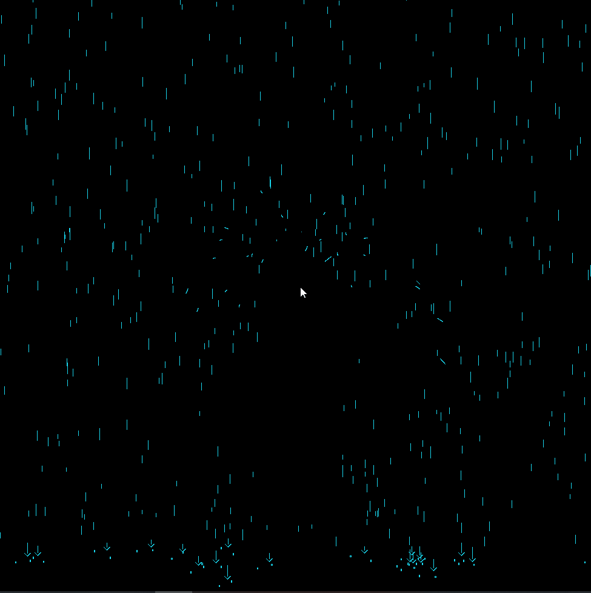
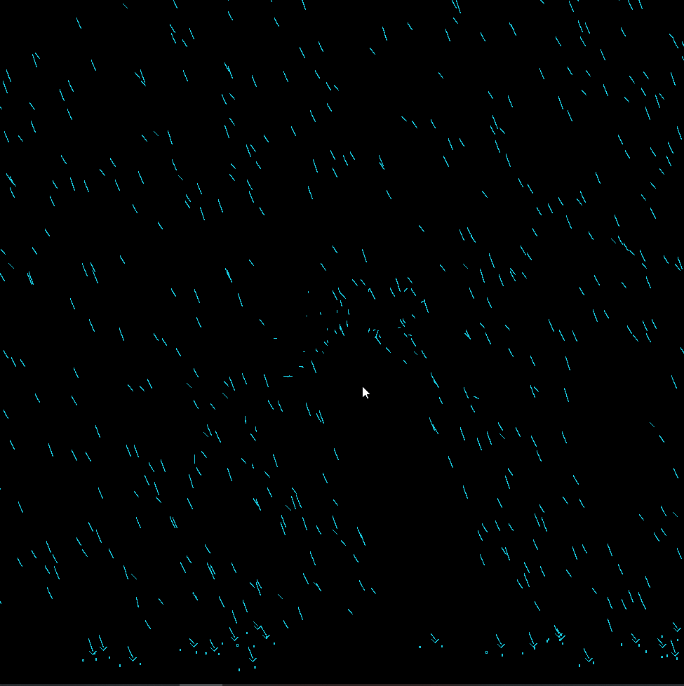

# Rainy-Days

A visualization of rain using Java Swing and AWT classes. 

Rain effects that affect the direction of the rain.

Umbrella mode which repels rain away from your mouse. Activate it and disable it by clicking.

Change the colour of the rain by clicking as well. (Colour is randomized)

Credits to Francis Piche tutorial.
